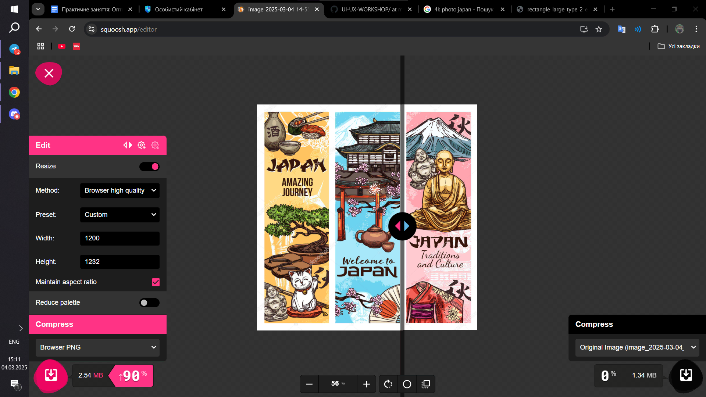
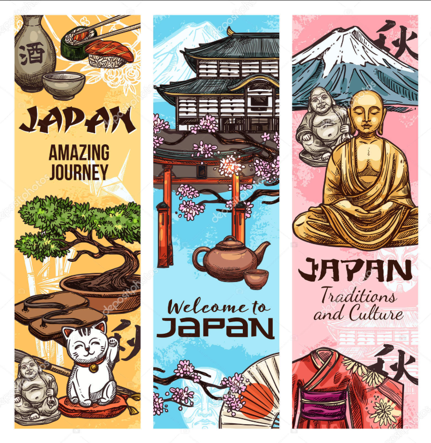

# Оптимізація зображень

## Початкові зображення
У звіті використовуються три вихідні зображення:
1. **Фотографія (image.jpg)** – звичайне фото.
2. **Скріншот (screen.png)** – зображення інтерфейсу.
3. **Графічне зображення з текстом (graphicimagewithtext.png)** – графічне зображення з текстом.

| Назва файлу | Формат | Розмір (px) | Вага (MB) |
|-------------|--------|------------|----------|
| image.jpg | JPEG | 1920x1080 | 1.34 MB |
| screen.png | PNG | 1365x768 | 2.54 MB |
| graphicimagewithtext.png | PNG | 852x875 | 1.27 MB |

## Порівняння форматів після стиснення

### Компресія у Squoosh

| Назва файлу | Формат | Розмір (px) | Вага до (MB) | Вага після (MB) | Відсоток зменшення |
|-------------|--------|------------|--------------|--------------|----------------|
| image.jpg | WebP | 1920x1080 | 1.34 MB | 0.45 MB | -66% |
| screen.png | AVIF | 1365x768 | 2.54 MB | 0.38 MB | -85% |
| graphicimagewithtext.png | WebP | 852x875 | ? MB | ? MB | ? |

## Адаптація зображень

Для оптимізації під різні пристрої створені версії зображень:

| Назва файлу | Оригінал (px) | Веб (1200px) | Мобільний (600px) |
|-------------|--------------|-------------|-------------|
| image.jpg | 1920x1080 | 1200x675 | 600x338 |
| screen.png | 1365x768 | 1200x675 | 600x338 |
| graphicimagewithtext.png | 852x875 | 1200x1232 | 600x616 |

## Retina-версії зображень

Щоб адаптувати зображення для Retina-дисплеїв, створені версії у 2x та 3x:

| Назва файлу | Оригінал (px) | 2x (px) | 3x (px) |
|-------------|--------------|--------|--------|
| image.jpg | 1920x1080 | 3840x2160 | 5760x3240 |
| screen.png | 1365x768 | 2730x1536 | 4095x2304 |
| graphicimagewithtext.png | 852x875 | 1704x1750 | 2556x2625 |

## Вставлені зображення

Оригінал фото:

Стиснена версія:

Оригінал cкріншоту:

Стиснена версія:

Оригінал графічного зображення з текстом:

Стиснена версія:

## Висновки

1. **Формати:**  
   - WebP підходить для фотографій.  
   - AVIF дає кращий результат для скріншотів, але може мати проблеми з підтримкою.  
   - PNG краще використовувати для зображень з текстом та прозорістю.  

2. **Зменшення розміру:**  
   - Найбільше стиснення — у AVIF, але підтримка браузерами обмежена.  
   - WebP дає баланс між якістю і розміром.  
   - PNG залишається великим, якщо не зменшувати палітру кольорів.  

3. **Адаптація для пристроїв:**  
   - **1200px** для вебу.  
   - **600px** для мобільних пристроїв.  
   - **2x, 3x** для Retina-дисплеїв.  

## Розміщення звіту
Файли розміщено у GitHub-репозиторії:

